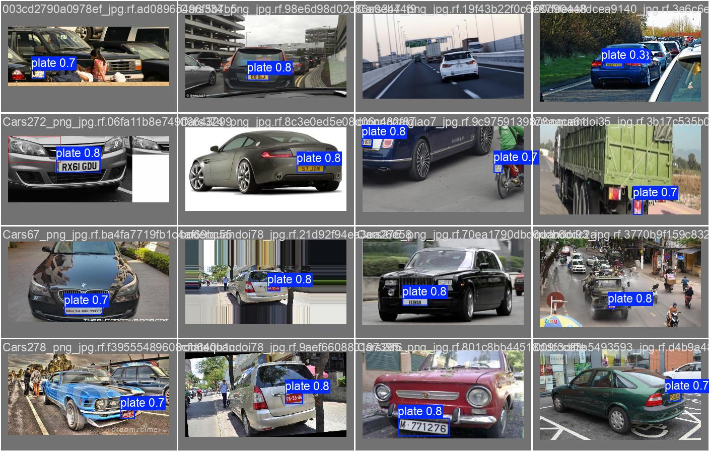

# TunisPark AI — Intelligent Parking Management System

> AI-powered Tunisian parking management: YOLOv8 plate detection · EasyOCR · RAG AI assistant · Real-time dashboard

**Competition:** Institut International de Technologie / NAU — Prize: 500 TND + PFE Stage

---

## Architecture

```
SmartParkTN/
├── frontend/          React 19 + Vite + TypeScript + shadcn/ui dashboard
├── backend/           FastAPI + SQLAlchemy 2.0 + LangChain RAG API
├── vision/            YOLOv8 · EasyOCR · DeepSORT pipeline
├── training/          Detector & OCR training scripts
├── knowledge_base/    PDF parking regulations (RAG source)
└── docker-compose.yml PostgreSQL + Redis only (everything else runs locally)
```

---

## Quick Start

### 1. Start infrastructure (PostgreSQL + Redis)
```bash
docker compose up -d
```

### 2. Backend
```bash
cd backend
venv\Scripts\activate          # venv already created
pip install -r requirements.txt
alembic upgrade head           # creates all tables
uvicorn app.main:socket_app --reload --port 8000
```

### 3. Initialize Database (Admin & Seed Data)
We have utility scripts to quickly set up a Super Admin and populate the system with mock entities (cameras, sessions, events) for testing.

```bash
cd backend
python init_admin.py  # Creates the superadmin user
python seed_data.py   # Populates the database with test data
```

### 4. Frontend
```bash
cd frontend
npm install
npm run dev
# → http://localhost:5173
```

### 5. API docs
```
http://localhost:8000/docs
```

---

## AI Assistant Setup (RAG)

Ollama with Mistral is already installed locally.

```bash
# 1. Add regulation PDFs to knowledge_base/

# 2. Build FAISS index from backend venv
cd backend
python -m app.ai.embedder
```

The assistant is then live at the `/assistant` page and `POST /api/assistant/chat`.

---

## Vision Pipeline

```bash
cd vision
venv\Scripts\activate
pip install -r requirements.txt
set GATE_ID=gate_01
set STREAM_SOURCE=0       # 0 = webcam, or rtsp://...
python main.py
```

Requires `vision/models/plate_detector.pt`. The trained model is already available at `vision/models/plate_detector.pt` (trained on `keremberke/license-plate-object-detection`, mAP@50 = 97.3%).

---

## Training

```bash
cd training
venv\Scripts\activate
pip install -r requirements.txt

# Fetch dataset and format to YOLO
python download_hf_data.py

# Augment labeled data
python augment.py --input data/labeled --output data/augmented --count 5        

# Train plate detector
python train_detector.py --epochs 50 --batch 16 --imgsz 640

# Evaluate
python evaluate.py --mode detector --model models/plate_detector.pt --data plates.yaml
python evaluate.py --mode ocr --images data/ocr/test/images --labels data/ocr/test/labels
```

---

## Training Results

YOLOv8n fine-tuned on `keremberke/license-plate-object-detection` (6176 images) — 25 epochs on NVIDIA GTX 1660 Ti.

| Metric | Score |
|--------|-------|
| Precision | **99.1%** |
| Recall | **94.3%** |
| mAP@0.50 | **97.3%** |
| mAP@[0.50:0.95] | **70.1%** |

**Training curves**


**F1 Confidence Curve**


**Validation Predictions (sample)**



**Confusion Matrix**


---

## Default Login

| Username | Password | Role |
|----------|----------|------|
| admin | admin123 | superadmin |

> Change via Admin → User Management after first login.

---

## Tech Stack

| Layer | Technology |
|-------|------------|
| Frontend | React 19, Vite 8, TypeScript, Tailwind CSS v4, shadcn/ui, Zustand, Recharts, Socket.IO |
| Backend | FastAPI, SQLAlchemy 2.0, Alembic, PostgreSQL 16, Redis 7, JWT, bcrypt |
| AI / RAG | LangChain 0.3, FAISS-cpu, sentence-transformers, Ollama (Mistral 7B — local) |
| Vision | YOLOv8 (ultralytics), EasyOCR, DeepSORT, OpenCV |
| Infra | Docker Compose (postgres + redis), local Ollama |

---

## Implementation Status

See [CURRENT_IMPLEMENTATION.md](CURRENT_IMPLEMENTATION.md) for a detailed breakdown of every component, what's working, and what's pending.

